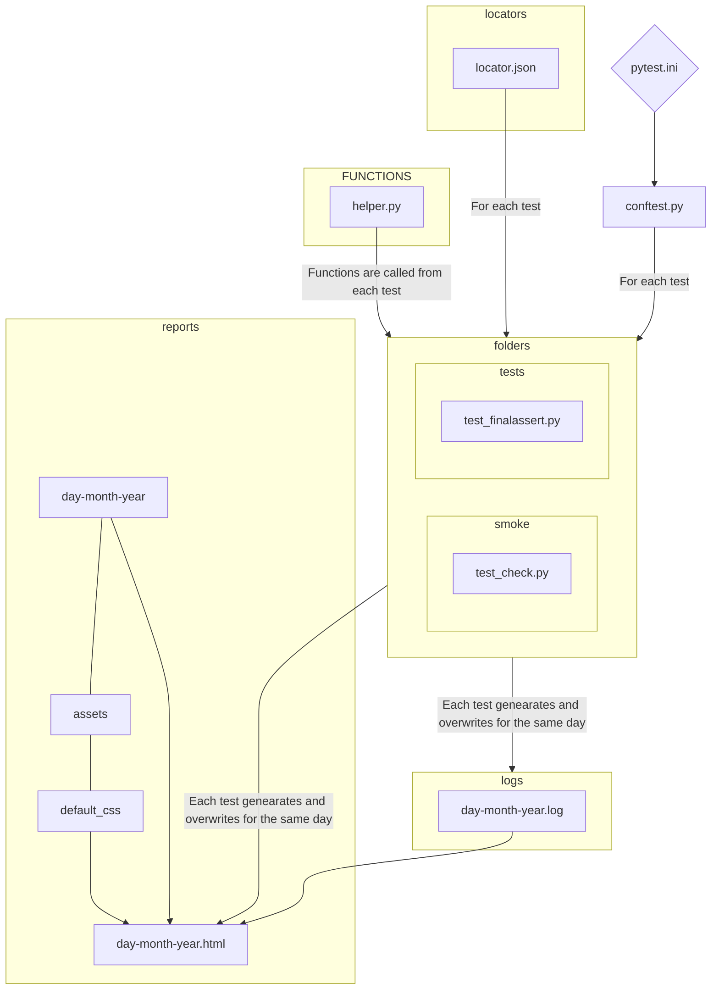
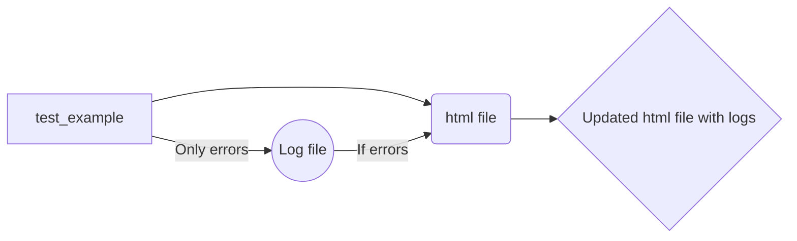

# Flowchart

## Functions of important files

|             | Function                                                                                                                                       | Changes allowed                                                                            |
|-------------|------------------------------------------------------------------------------------------------------------------------------------------------|--------------------------------------------------------------------------------------------|
| pytest.ini  | This file starts first and contains the configurations for the tests.                                                                      | testspaths can be changed addopts function can be modified as per the commands needed. |
| conftest.py | This file runs after `pytest.ini`, contains the logic to run tests in multiple browsers simultaneously, also Html file can be configured here. | New browser web drivers can be added, Html file can be configured as per convenience.  |
| helper.py   | All test cases use functions from this file.                                                                                                   | New browser action functions can be added.                                                 |

## Defaults

#### The default folders set in `pytest.ini` to run tests is:
 - #### smoke

*Default folders can be changed from `pytest.ini` file.*

#### `pytest.ini` addopts verbose printing for detailed output, and uses commands of pytest-parallel, pytest-instafail,pytest-excel to modify the results.

## How html file is created:

